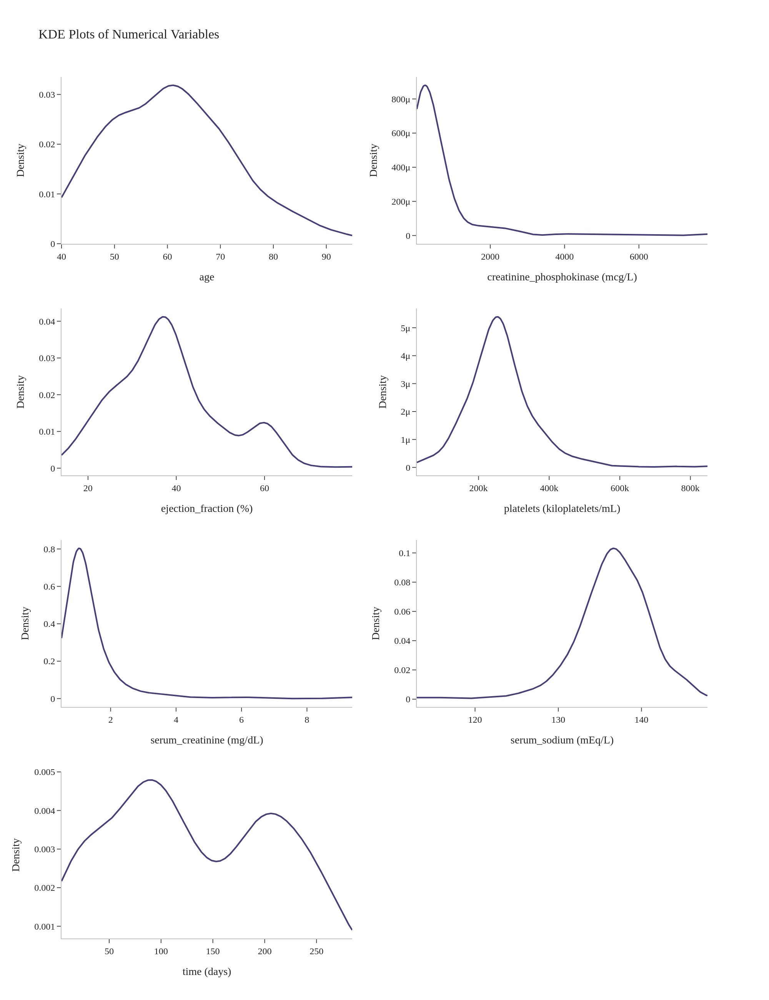
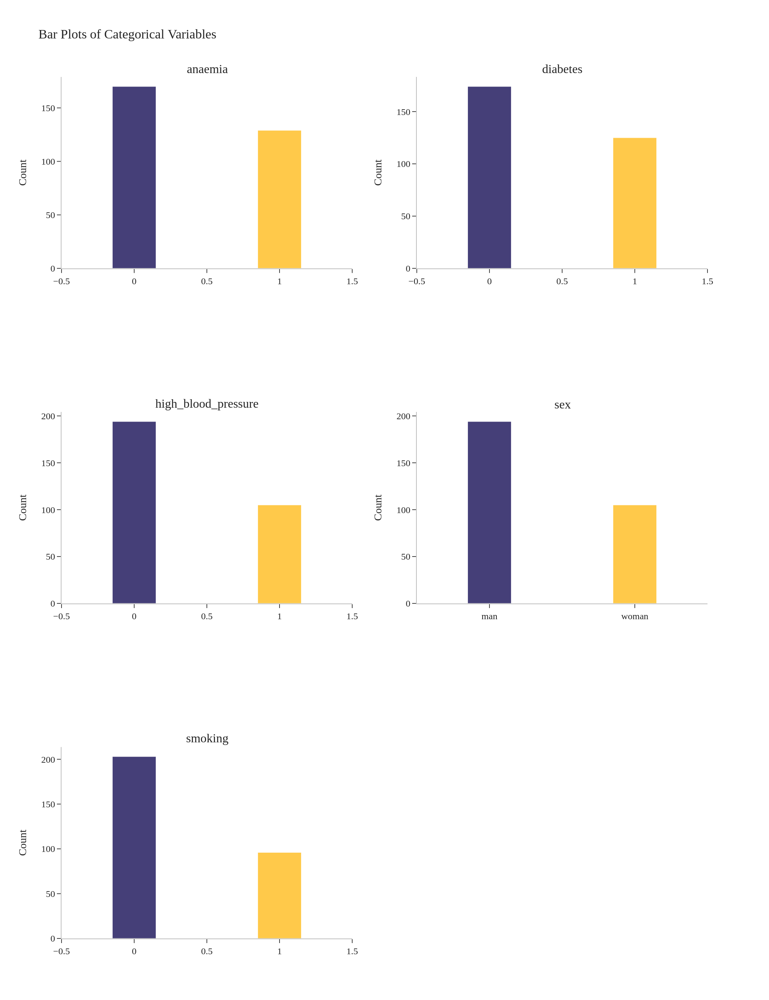
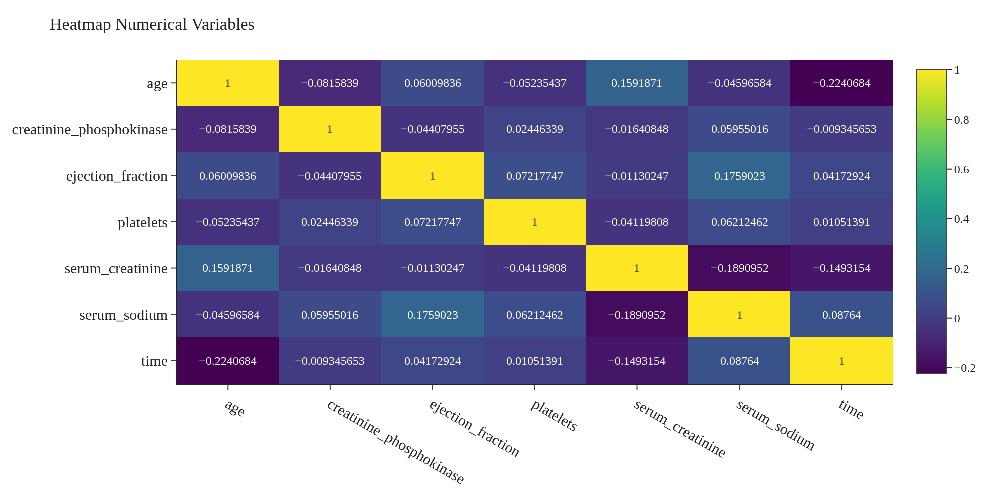
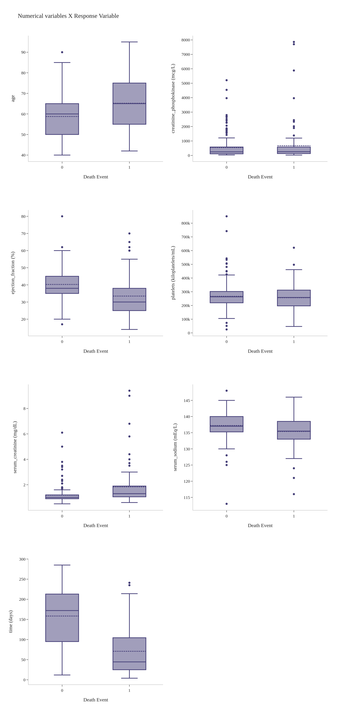
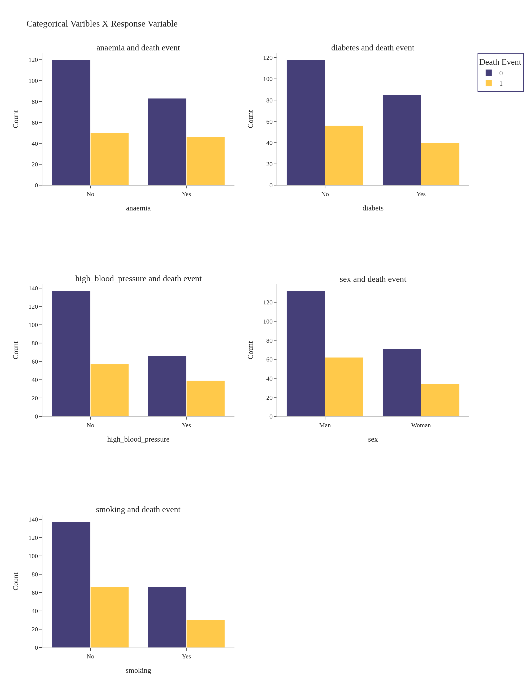
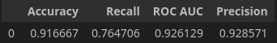
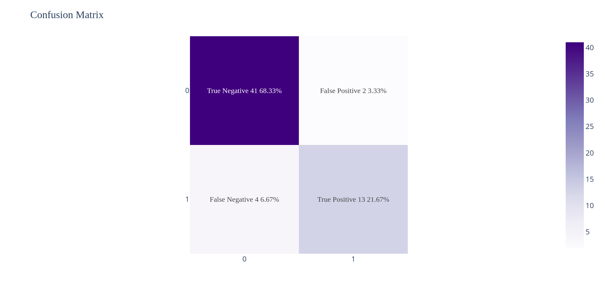
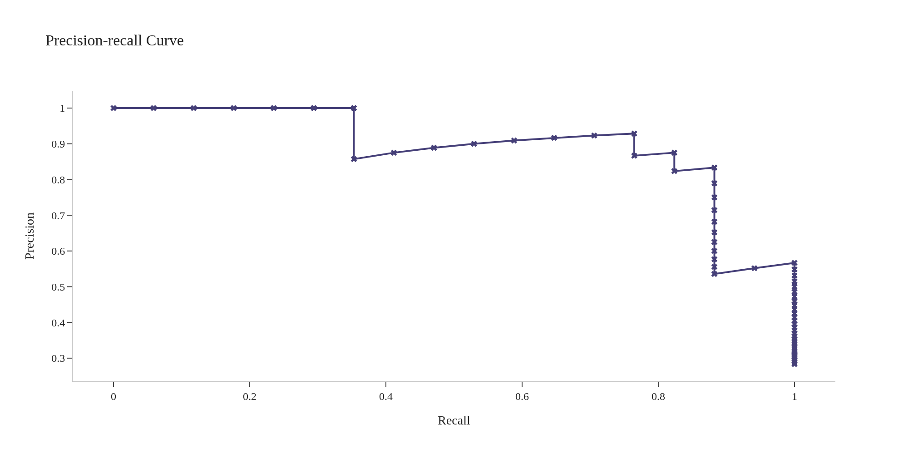
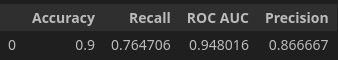

# Prediction Survive Heart Failure
---
## Overview of project
In this project, was made a model of machine learning using the Logistic Regression for predicted the person that had heart failure would survive or not.

### Project structure
- `data` folder that contain the datas.
- `eda` folder that contain the notebook of exploratory data analysis.
- `modeling` folder that contain the notebook of modeling.
- `src` folder that contain the images that are use in readme.
---
## Description of problem
A hospital wants to develop a machine learning model to predict whether or not a person with heart failure will survive during the patient's follow-up period. To develop this model, the hospital has a database that contains information on patients who had heart failure.

---
## Exploratory Data Analysis

### About Dataset

This dataset contains the medical records of 299 patients who had heart failure, collected during their follow-up period, where each patient profile has 13 clinical features.

Link dataset: https://archive.ics.uci.edu/dataset/519/heart+failure+clinical+records

---
### Insights

  
Some observations:
- The highest concentration of age is between 50 and 70 years.
- The variable **creatinine_phosphokinase** is a distribution positive asymmetric. Because the normal values of **creatinine_phosphokinase** is 10 to 120 mcg/L, but there some people that are with the high level of **creatinine_phosphokinase**.
- The variable **serum_creatinine** also is a distribution positive asymmetric. Because the normal values of **serum_creatinine** is 0.7 to 1.3 mg/dL, but there some people that are with the high level of **serum_creatinine**.
- The variable **platelets** also is a distribution positive asymmetric a little softer. Because the normal values of **platelets** is 150 to 450 kiloplatelets/mL, but there few people that are with the high level of **platelets**.
- The variable **serum_sodium** is a distribution negative asymmetric. Because the normal values of **serum_sodium** is 135 to 145 mEq/L, but there few people that are with the low level of **serum_sodium**.  

  
Some observations:
- The numbers of men is almost double the number of women.
- Most of the people that had heart failure, doesn't smoking.
- Most of the people that had heart failure, doesn't had high blood pressure.

- The numerical variables has much little correlation each other.

  
Some observations:
- The mean of people that had heart failure and dead is 65 years, that show how older the person more chance of died . And also can be observed that only one person that had 90 years doesn't died.
- There a high level of creatinine_phosphokinase doesn't indicate that the person that had heart failure will have more chance death. This also occur with serum_creatinine.
- If the person had one mean of 160 days of follow-up or more, your survival chance is biggest.

Some observations:
- There high blood pressure didn't important fact for the person death that had heart failure, like also smoking, anaemia and diabets.
- Of 194 men that had heart failure 68,04% suirvived and of 105 women that had heart failure 67,62% also survived. And this show that the sex of person didn't important fact for the person death.

---
## Modeling
Was made a model with all features of dataset for predict response variable, after was made again a model applying feature selection for choice a better features for predict response variable.

### Model with all features

Observing the confusion matrix above, the model with all features classified 4 false negative and this is bad, because the people that were classified as false negative dead.

- AUC precision-recall curve : 88.25%  
- Can be observed that precision-recall curve and AUC show that precision is good for this model with all features.

---
### Model with best features

Comparing with a model with all features, the model with best features there a increased in the ROC AUC, but the Precision descreased this show that model with best features is classifying more instances like positives, but this is bad because the number of false positives also will increse.

Some observations:
- As already mentioned above the model with best features is classifying more instances like positives and this also increase the number of false positive.
- Both the models couldn't decrease the number of false negative, despite having classified just 4 false negative this is bad because show that 4 people dead due a wrong classification.

- AUC precision-recall curve: 88.87%
- Can be observed that precision-recall curve and AUC show that precision of model with best features is better for classify positives.

---
## Conclusion
In this project, the goal was develop a model of machine learning for predict if a person that had heart failure during follow-up would survive or not. Using a model with a best features obtained a perfomance a little better than with all features. But the model with best features can't decrease the number of false positives, perhaps with a larger dataset and using technics more advanced like feature engineering the model would permormance better. Despite that, the model had a good performance with a dataset that used.